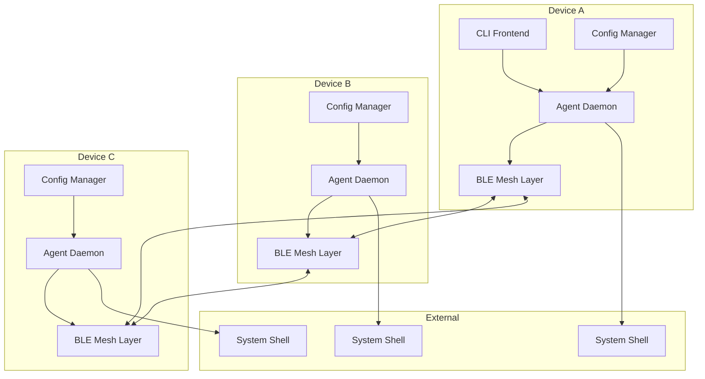

# Design Document

## Overview

MeshExec CLI is a decentralized command execution system built in Go that creates a self-healing Bluetooth LE mesh network for secure shell command execution across distributed devices. The system consists of a CLI frontend, mesh networking layer, agent daemon, and configuration management system that work together to provide reliable, secure, and targeted command execution without requiring centralized infrastructure.

## Architecture



The architecture follows a distributed peer-to-peer model where each device runs the same agent daemon capable of both sending and receiving commands. The mesh network provides redundant paths for message delivery, ensuring reliability even when direct connections fail.

## Components and Interfaces

### CLI Frontend (`cmd/meshexec`)

**Purpose**: Provides user interface for command execution and network management

**Key Interfaces**:
```go
type CommandRunner interface {
    RunCommand(ctx context.Context, cmd string, target string, options RunOptions) (*ExecutionResults, error)
    RunDryRun(cmd string, target string) (*DryRunResults, error)
}

type NetworkManager interface {
    JoinMesh(ctx context.Context) error
    LeaveMesh() error
    ListPeers() ([]PeerInfo, error)
    GetStatus() (*NetworkStatus, error)
}

type TUIManager interface {
    StartTUI(ctx context.Context) error
    UpdateResults(results *ExecutionResults)
    UpdatePeers(peers []PeerInfo)
}
```

**Subcommands**:
- `run`: Execute commands with targeting and options
- `join`: Start mesh participation
- `list`: Display connected peers
- `status`: Show execution status
- `tui`: Launch terminal UI dashboard

### Mesh Network Layer (`internal/mesh`)

**Purpose**: Handles Bluetooth LE communication, message routing, and network topology management

**Key Interfaces**:
```go
type MeshNode interface {
    Start(ctx context.Context) error
    Stop() error
    SendMessage(msg *MeshMessage) error
    Subscribe(msgType MessageType) <-chan *MeshMessage
    GetPeers() []PeerInfo
}

type BLETransport interface {
    Advertise(ctx context.Context, serviceData []byte) error
    Scan(ctx context.Context) (<-chan *Advertisement, error)
    Connect(ctx context.Context, addr string) (*Connection, error)
    CreateGATTService() (*GATTService, error)
}
```

**Message Format**:
```go
type MeshMessage struct {
    ID        string            `json:"id"`
    TTL       int              `json:"ttl"`
    Sender    string           `json:"sender"`
    Target    []string         `json:"target"`
    Type      MessageType      `json:"type"`
    Command   string           `json:"command,omitempty"`
    Payload   []byte           `json:"payload,omitempty"`
    Signature string           `json:"signature"`
    Timestamp int64            `json:"timestamp"`
}

type MessageType string
const (
    MessageTypeCommand MessageType = "cmd"
    MessageTypeResult  MessageType = "result"
    MessageTypePing    MessageType = "ping"
    MessageTypePong    MessageType = "pong"
)
```

### Agent Daemon (`internal/agent`)

**Purpose**: Core service that processes commands, manages execution, and handles security

**Key Interfaces**:
```go
type Agent interface {
    Start(ctx context.Context) error
    Stop() error
    ProcessCommand(msg *MeshMessage) error
    ExecuteCommand(cmd string) (*ExecutionResult, error)
    ValidateCommand(msg *MeshMessage) error
}

type CommandExecutor interface {
    Execute(ctx context.Context, cmd string) (*ExecutionResult, error)
    ValidateCommand(cmd string) error
}

type SecurityManager interface {
    SignMessage(msg *MeshMessage) error
    VerifySignature(msg *MeshMessage) error
    EncryptPayload(payload []byte) ([]byte, error)
    DecryptPayload(encrypted []byte) ([]byte, error)
}
```

**Execution Result Format**:
```go
type ExecutionResult struct {
    ID       string `json:"id"`
    Type     string `json:"type"`
    Status   string `json:"status"`
    Stdout   string `json:"stdout"`
    Stderr   string `json:"stderr"`
    ExitCode int    `json:"code"`
    Device   string `json:"device"`
    Duration int64  `json:"duration_ms"`
}
```

### Configuration Manager (`internal/config`)

**Purpose**: Handles configuration file parsing and device settings management

**Key Interfaces**:
```go
type ConfigManager interface {
    Load() (*Config, error)
    Save(config *Config) error
    Watch(ctx context.Context) (<-chan *Config, error)
}

type Config struct {
    Device   DeviceConfig   `toml:"device" ini:"device"`
    Security SecurityConfig `toml:"security" ini:"security"`
    Network  NetworkConfig  `toml:"network" ini:"network"`
    Safety   SafetyConfig   `toml:"safety" ini:"safety"`
}

type DeviceConfig struct {
    Name     string            `toml:"name" ini:"name"`
    Role     string            `toml:"role" ini:"role"`
    Tags     map[string]string `toml:"tags" ini:"tags"`
    OS       string            `toml:"os" ini:"os"`
    Arch     string            `toml:"arch" ini:"arch"`
}
```

### Target Expression Engine (`internal/targeting`)

**Purpose**: Evaluates device targeting expressions for command routing

**Key Interfaces**:
```go
type TargetEvaluator interface {
    Evaluate(expression string, device *DeviceInfo) (bool, error)
    Parse(expression string) (*TargetAST, error)
}

type DeviceInfo struct {
    Name string
    Role string
    OS   string
    Arch string
    Tags map[string]string
}
```

**Supported Expressions**:
- `os=linux && role=worker`
- `!arch=arm`
- `role=logger || role=monitor`
- `all`

## Data Models

### Core Message Types

**Command Message**:
```go
type CommandMessage struct {
    MeshMessage
    Command   string   `json:"command"`
    Arguments []string `json:"arguments,omitempty"`
    WorkDir   string   `json:"workdir,omitempty"`
    Timeout   int      `json:"timeout,omitempty"`
}
```

**Result Message**:
```go
type ResultMessage struct {
    MeshMessage
    CommandID string          `json:"command_id"`
    Result    ExecutionResult `json:"result"`
}
```

### Network State

**Peer Information**:
```go
type PeerInfo struct {
    ID           string            `json:"id"`
    Name         string            `json:"name"`
    Address      string            `json:"address"`
    Role         string            `json:"role"`
    OS           string            `json:"os"`
    Arch         string            `json:"arch"`
    Tags         map[string]string `json:"tags"`
    LastSeen     time.Time         `json:"last_seen"`
    Connected    bool              `json:"connected"`
    SignalStrength int             `json:"signal_strength"`
}
```

**Network Topology**:
```go
type NetworkTopology struct {
    LocalNode PeerInfo            `json:"local_node"`
    Peers     []PeerInfo          `json:"peers"`
    Routes    map[string][]string `json:"routes"`
    Updated   time.Time           `json:"updated"`
}
```

## Error Handling

### Error Types

```go
type MeshExecError struct {
    Type    ErrorType `json:"type"`
    Message string    `json:"message"`
    Code    string    `json:"code"`
    Details map[string]interface{} `json:"details,omitempty"`
}

type ErrorType string
const (
    ErrorTypeNetwork     ErrorType = "network"
    ErrorTypeExecution   ErrorType = "execution"
    ErrorTypeSecurity    ErrorType = "security"
    ErrorTypeConfig      ErrorType = "config"
    ErrorTypeTargeting   ErrorType = "targeting"
)
```

### Error Handling Strategy

1. **Network Errors**: Retry with exponential backoff, attempt alternative routes
2. **Execution Errors**: Return detailed error information to sender
3. **Security Errors**: Log security violations, reject messages
4. **Configuration Errors**: Fall back to defaults, log warnings
5. **Targeting Errors**: Skip invalid expressions, continue with valid ones

### Logging

```go
type Logger interface {
    Debug(msg string, fields ...Field)
    Info(msg string, fields ...Field)
    Warn(msg string, fields ...Field)
    Error(msg string, fields ...Field)
    Fatal(msg string, fields ...Field)
}
```

**Log Levels**:
- DEBUG: Detailed mesh message flow, BLE events
- INFO: Command execution, peer connections
- WARN: Configuration issues, network problems
- ERROR: Security violations, execution failures
- FATAL: System startup failures

## Testing Strategy

### Unit Testing

**Test Coverage Areas**:
- Message serialization/deserialization
- Target expression evaluation
- Command execution logic
- Security signature verification
- Configuration parsing

**Mock Interfaces**:
```go
type MockBLETransport struct {
    advertisements chan *Advertisement
    connections    map[string]*MockConnection
    services       map[string]*MockGATTService
}

type MockCommandExecutor struct {
    results map[string]*ExecutionResult
    errors  map[string]error
}
```

### Integration Testing

**Test Scenarios**:
1. **Multi-node mesh formation**: Simulate 3-5 devices joining mesh
2. **Command propagation**: Verify commands reach all targeted devices
3. **Network partitioning**: Test mesh healing when connections fail
4. **Security validation**: Test signature verification and encryption
5. **Configuration loading**: Test TOML/INI file parsing

**Test Infrastructure**:
```go
type TestMesh struct {
    nodes    []*TestNode
    network  *MockBLENetwork
    messages chan *MeshMessage
}

func (tm *TestMesh) CreateNode(config *Config) *TestNode
func (tm *TestMesh) ConnectNodes(nodeA, nodeB string) error
func (tm *TestMesh) DisconnectNodes(nodeA, nodeB string) error
func (tm *TestMesh) SendCommand(from string, cmd *CommandMessage) error
```

### End-to-End Testing

**Docker-based Testing**:
- Multi-container setup simulating separate devices
- Bluetooth LE emulation using virtual adapters
- Automated test scenarios with command execution verification

**Performance Testing**:
- Message latency across mesh hops
- Network throughput with multiple concurrent commands
- Memory usage during long-running operations
- Battery impact on mobile devices

### Security Testing

**Security Test Cases**:
1. **Signature tampering**: Verify rejection of modified messages
2. **Replay attacks**: Test message ID duplicate detection
3. **Command injection**: Validate safe command execution
4. **Unauthorized access**: Test allow/deny list enforcement

## Dependencies

### External Libraries

```go
// go.mod dependencies
require (
    github.com/spf13/cobra v1.7.0           // CLI framework
    github.com/spf13/viper v1.16.0          // Configuration management
    github.com/BurntSushi/toml v1.3.2       // TOML parsing
    go.bug.st/serial v1.6.0                 // Serial/BLE communication
    github.com/google/uuid v1.3.0           // UUID generation
    golang.org/x/crypto v0.12.0             // Cryptographic functions
    github.com/charmbracelet/bubbletea v0.24.2 // TUI framework
    github.com/rs/zerolog v1.30.0           // Structured logging
    github.com/stretchr/testify v1.8.4      // Testing framework
)
```

### System Dependencies

- **Bluetooth LE Support**: BlueZ on Linux, Core Bluetooth on macOS
- **Shell Access**: `/bin/sh` or equivalent system shell
- **File System**: Read/write access for configuration and logs

## Security Considerations

### Cryptographic Design

**Key Management**:
- Ed25519 key pairs for message signing
- Key generation on first startup
- Optional key import/export for shared trust

**Message Security**:
- All messages signed with sender's private key
- Optional AES-GCM encryption with pre-shared keys
- Timestamp validation to prevent replay attacks

**Command Safety**:
- Configurable command filtering (blacklist/whitelist)
- Safe mode to prevent destructive operations
- Execution timeout limits
- User privilege validation

### Network Security

**Peer Authentication**:
- Public key exchange during mesh join
- Trust-on-first-use (TOFU) model
- Manual key verification support

**Attack Mitigation**:
- TTL limits prevent infinite message loops
- Rate limiting for command execution
- Message size limits to prevent DoS
- Duplicate message detection